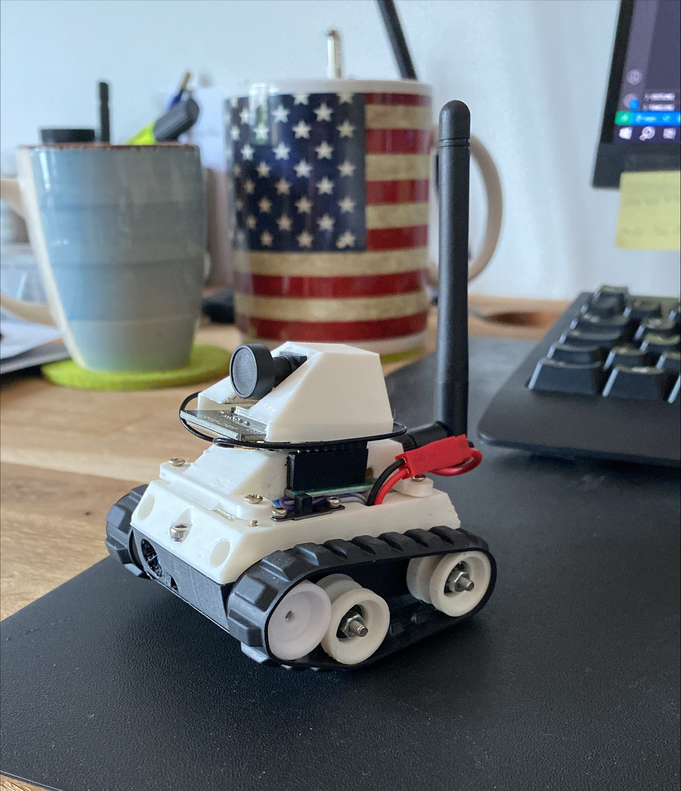

# MQTT Tiny Rover

MQTT Tiny Rover based on ESP32Cam.

L9110S H-Bridge Stepper Motor Dual DC Motor

https://randomnerdtutorials.com/esp32-cam-ov2640-camera-settings/
https://wokwi.com/projects/360194707275211777
https://how2electronics.com/connecting-esp32-to-amazon-aws-iot-core-using-mqtt/
https://github.com/gilmaimon/ArduinoWebsockets/blob/master/examples/Esp32-Client/Esp32-Client.ino
https://stackoverflow.com/questions/64175514/esp32-cam-websocket-wifimulti-reconnect

Author: cmb87